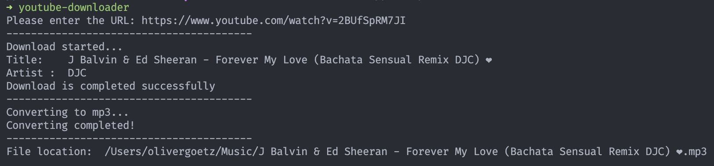

# Python YouTube-Downloader

Download videos from YouTube and directly convert them to mp3.

Mp3 files are always stored in the `$HOME/Music/`

## Getting started

```bash
# 1. Install dependencies
$ pip install -t requirements.txt

# 2.Install youtube downloader
$ pip install path/to/yt.py

# 3. Run the script form your command line
$ youtube-downloader
```

